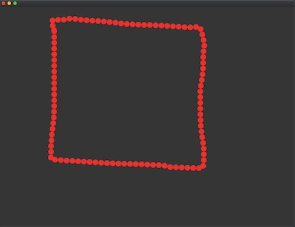
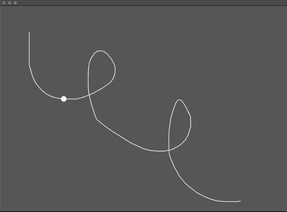
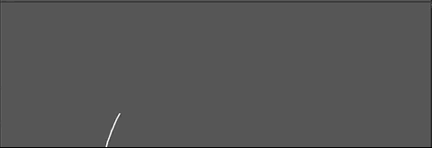
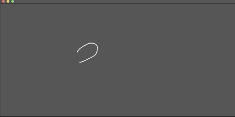
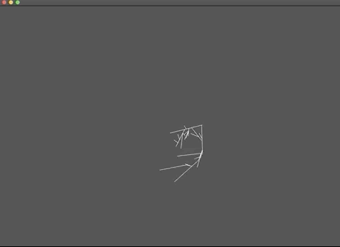
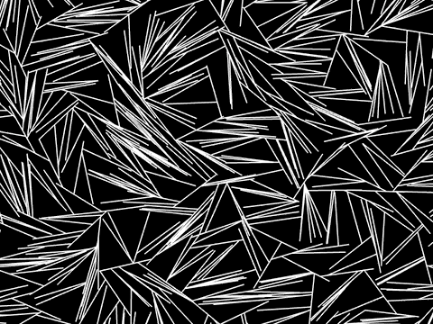
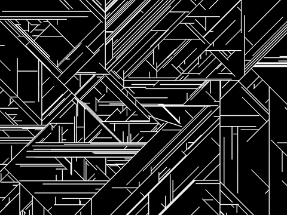
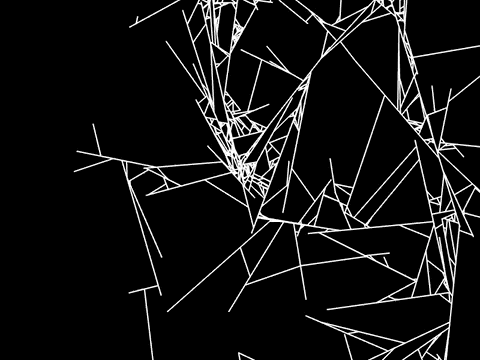
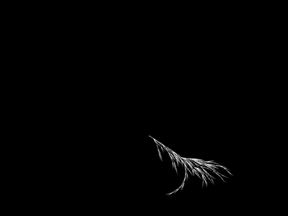
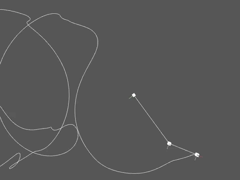

# MAS.S62 DrawingPlusPlus class notes

## About

* MAS.S62 is a class by Zach Lieberman
* Taught at MIT Media Lab, spring semester 2020
* Teaching assistant: Aarón Montoya-Moraga

## Class 1: Tuesday February 18 2020

### Assignment for next class:

* Readings on shared Dropbox folder
* Install and setup [openFrameworks](https://openframeworks.cc/)
* Document all the drawings you encounter until next class.

### Setup of openFrameworks and this repository

* Go to [https://openframeworks.cc/](https://openframeworks.cc/)
* Download openFrameworks for your operating system, current version is 0.11.0.
* Unzip, and place the folder "of_v0.10.1_osx_release" in your home directory.
* Clone this repository [https://github.com/ofZach/MIT_DrawingPlusPlus](https://github.com/ofZach/MIT_DrawingPlusPlus) with the following command.

```zsh 
git clone "https://github.com/ofZach/MIT_DrawingPlusPlus.git"
```

* Place this repository inside of the folder apps/ on your openFrameworks.

* Whenever you want to update your local repository to the one on the cloud, use the command

```zsh
git pull
```

* The first time you build the project, it might take longer.

* If you have any doubts, please let us know on class, Slack, or come to office hours.

### Programming notes:

```cpp
// set background
ofBackground(0);

// draw a circle on mouse position if mouse is pressed
if (ofGetMousePressed()) {
  ofDrawCircle(mouseX, mouseY, 20);
}
```

If we need objects to be accesible across multiple frames or methods, we can declare them on the header .h file.

```cpp
// declare a line
ofPolyline line;
// draw a line
line.draw();
// delete a line
line.clear();
```

```cpp
// add random noise to a line
for (int i = 0; i < line.size(); i++) {
  line[i].x += ofRandom(-1, 1);
  line[i].y += ofRandom(-1, 1);
}
```

```cpp
// retrieve time
float time = ofGetElapsedTimef();
```

```cpp
// resample a line
ofPolyline resampled = line.getResampledBySpacing(10);
```

### Code examples

* basicDrawing: black background, white circles are drawn when the mouse is pressed. The circles remain forever.


* basicDrawing2: black background, white continuous line drawn on top, made with ofPolyline.


* basicDrawing3: black background, square shape drawn with a stroke made out of tiny red circles. This stroke is achieved by using a polyLine, resampling this line, and then drawing the resampled line using red circles.



## Class 2: Wednesday February 19 2020

### Taxonomy of drawings

* Intentional / unintentional
* Finished / in-progress / censored
* Permanent / intermitent
* Animal / nature
* One-glance / several glances
* Flat / several dimensions
* Utilitarian / non utilitarian

### Drawing exercise

* Each person takes a piece of paper, puts their name and the number 1 on it, and then writes a set of instructions for doing a drawing.
* Everyone swaps their paper with instructions.
* Each person takes a new piece of paper, and labels it with the same name on the piece of paper they got, and one number up.
* Follow the instructions and draw on your paper.
* Keep your paper with drawings and put the one you received on the shared pile.
* Everyone swaps their paper with drawings.
* Each person takes a new piece of paper, and labels it with the same name on the piece of paper they got, and one number up.
* Look at the drawing and come up with the rules that were followed when your drawing was done.
* Keep your paper with instructions and put the one you received on the shared pile.
* Keep on swapping and going from drawing to instructions back and forth.
* At the end, gather the pile of papers and reconstruct the sequences for each person.

### Geometry notes

A point in 2D can be defined in different ways:
* A pair of (x,y) coordinates measured from an origin (0,0), where x is horizontal position, y is vertical position.
* As a collection of (r,theta) coordinates measured from an origin (0,0), where r is distance, and theta is angle (measured in degrees, radians).

A line in 2D can be defined in different ways:
* The segment that goes from point (x1, y1) to point (x2, y2).
* The segment that goes from point (x1, y1) a distance r in angle theta (r, theta)

### Programming notes

### Code examples

* drawingPlayback: black background, a white line on top, and a white dot plays back the stroke motion.



* drawing3d: the cursor is drawing on the screen plane, and this plane is rotating while the drawing is happening, resulting in a three dimensional drawing.



* drawingBackwards: the drawing is made on the opposite direction of the movement of the mouse cursor, and the drawing follows the mouse around.



* drawingRendering: the drawing is made using the cursor, for every click the screen is cleared, and dragging stores the trajectory of the mouse in a mesh, which is rendered using grayscale for each new vertex and the color changes sinusoidally over time. 


* generativeExample1: the drawing is white lines over gray background, where in every iteration, a random starting point on an existing line is picked, and then a new line is drawn from it, with a random angle and random length, only if this new line does not intersect with existing lines.



### Assignment

Build a computational drawing tool -- either one that takes gesture as input or that's based on rules (translating rules into drawing commands.)

## Class 3: Thursday February 20 2020

### Drawing exercise

We divided in groups and used drawing as a way of understanding computation. The groups tackled these topics:

* QR code
* Logic gates
* Line drawing

### Code examples

* generativeExample2: the drawing is white lines over black background, where in every iteration a new line is drawn starting from a point in an existing line, using a random angle and a fixed distance, only if this new line does not intersect with existing lines.



* generativeExample3: the drawing is white lines over black background, where in every iteration a new line is drawn starting from a point in an existing line, choosing a random angle multiple of 45 degrees (0, 45, 90, 135, 180, 225, 270, 315) and a random distance, only if this new line does not intersect with existing lines.



* generativeExample4: the drawing is white lines over black background, where in every iteration a new line is drawn starting from a random point in an existing line, choosing a random angle and a random distance. The new line is drawn only until it intersects with an existing line and only if this new line is larger than a threshold.



* generativeExample5: the drawing is white lines over black background, where in every iteration a new line is drawn starting from a random point in an existing line, choosing a random angle which is almost perpendicular (+90 or -90 degress plus a bit of noise). The new line is drawn only until it intersects with an existing line and only if this new line is larger than a threshold.


### Assignment

Make the largest possible drawing and the smallest possible drawing you can.

## Class 4: Friday February 20 2020

### Code examples

* generativeExample6: the drawing is white lines over black background, where in every iteration a new line is drawn starting from a random point in an existing line, choosing a random angle close to the original angle of the line. The line is drawn with a gradient color, going from fully opaque white in the start point to fully transparent in the end point. The new line is drawn only if it does not intersect with existing lines.



* node: 



### Assignment
