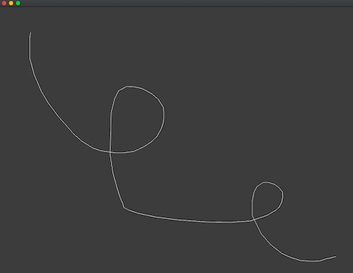
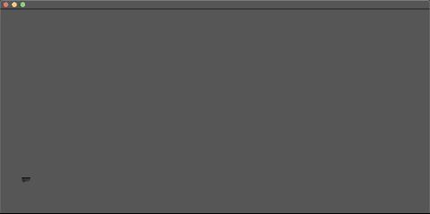

# MAS.S62 DrawingPlusPlus class notes

## About

* MAS.S62 is a class by Zach Lieberman
* Taught at MIT Media Lab, spring semester 2020
* Teaching assistant: Aarón Montoya-Moraga

## Class 1: Tuesday February 18 2020

### Assignment for next class:

* Readings on shared Dropbox folder
* Install and setup [openFrameworks](https://openframeworks.cc/)
* Document all the drawings you encounter until next class.

### Setup of openFrameworks and this repository

* Go to [https://openframeworks.cc/](https://openframeworks.cc/)
* Download openFrameworks for your operating system, current version is 0.11.0.
* Unzip, and place the folder "of_v0.10.1_osx_release" in your home directory.
* Clone this repository [https://github.com/ofZach/MIT_DrawingPlusPlus](https://github.com/ofZach/MIT_DrawingPlusPlus) with the following command.

```zsh 
git clone "https://github.com/ofZach/MIT_DrawingPlusPlus.git"
```

* Place this repository inside of the folder apps/ on your openFrameworks.

* Whenever you want to update your local repository to the one on the cloud, use the command

```zsh
git pull
```

* The first time you build the project, it might take longer.

* If you have any doubts, please let us know on class, Slack, or come to office hours.

### Programming notes:

```cpp
// set background
ofBackground(0);

// draw a circle on mouse position if mouse is pressed
if (ofGetMousePressed()) {
  ofDrawCircle(mouseX, mouseY, 20);
}
```

If we need objects to be accesible across multiple frames or methods, we can declare them on the header .h file.

```cpp
// declare a line
ofPolyline line;
// draw a line
line.draw();
// delete a line
line.clear();
```

```cpp
// add random noise to a line
for (int i = 0; i < line.size(); i++) {
  line[i].x += ofRandom(-1, 1);
  line[i].y += ofRandom(-1, 1);
}
```

```cpp
// retrieve time
float time = ofGetElapsedTimef();
```

```cpp
// resample a line
ofPolyline resampled = line.getResampledBySpacing(10);
```

### Code examples

* basicDrawing: black background, white circles are drawn when the mouse is pressed. The circles remain forever.


* basicDrawing2: black background, white continuous line drawn on top, made with ofPolyline.



* basicDrawing3: black background, square shape drawn with a stroke made out of tiny red circles. This stroke is achieved by using a polyLine, resampling this line, and then drawing the resampled line using red circles.


## Class 2: Wednesday February 19 2020

### Taxonomy of drawings

* Intentional / unintentional
* Finished / in-progress / censored
* Permanent / intermitent
* Animal / nature
* One-glance / several glances
* Flat / several dimensions
* Utilitarian / non utilitarian

### Drawing exercise

* Each person takes a piece of paper, puts their name and the number 1 on it, and then writes a set of instructions for doing a drawing.
* Everyone swaps their paper with instructions.
* Each person takes a new piece of paper, and labels it with the same name on the piece of paper they got, and one number up.
* Follow the instructions and draw on your paper.
* Keep your paper with drawings and put the one you received on the shared pile.
* Everyone swaps their paper with drawings.
* Each person takes a new piece of paper, and labels it with the same name on the piece of paper they got, and one number up.
* Look at the drawing and come up with the rules that were followed when your drawing was done.
* Keep your paper with instructions and put the one you received on the shared pile.
* Keep on swapping and going from drawing to instructions back and forth.
* At the end, gather the pile of papers and reconstruct the sequences for each person.

### Geometry notes

A point in 2D can be defined in different ways:
* A pair of (x,y) coordinates measured from an origin (0,0), where x is horizontal position, y is vertical position.
* As a collection of (r,theta) coordinates measured from an origin (0,0), where r is distance, and theta is angle (measured in degrees, radians).

A line in 2D can be defined in different ways:
* The segment that goes from point (x1, y1) to point (x2, y2).
* The segment that goes from point (x1, y1) a distance r in angle theta (r, theta)

### Programming notes

### Code examples

* drawingPlayback: black background, a white line on top, and a white dot plays back the stroke motion.


* drawing3d: the cursor is drawing on the screen plane, and this plane is rotating while the drawing is happening, resulting in a three dimensional drawing.


* drawingBackwards: the drawing is made on the opposite direction of the movement of the mouse cursor, and the drawing follows the mouse around.


* drawingRendering: 



* generativeExample1: 


### Assignment

Build a computational drawing tool -- either one that takes gesture as input or that's based on rules (translating rules into drawing commands.)

## Class 3: Thursday February 20 2020

## Class 4: Friday February 20 2020
